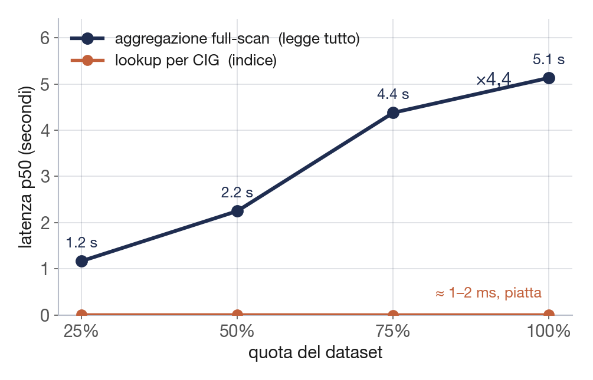
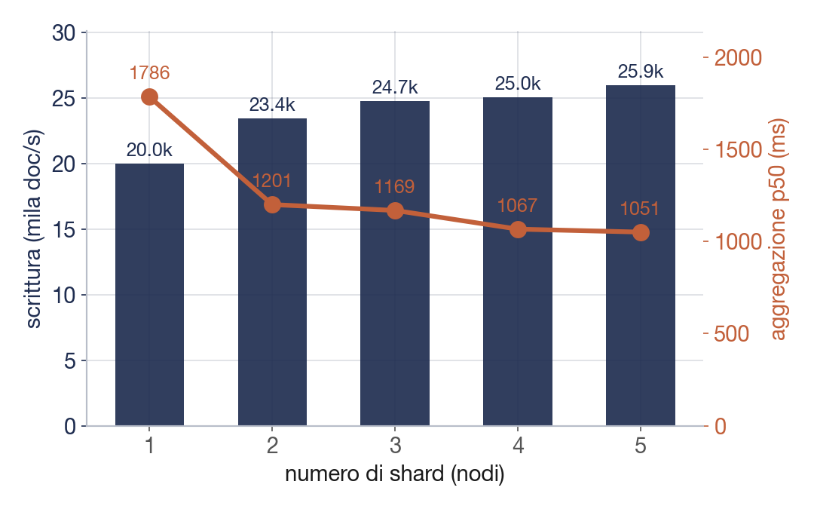
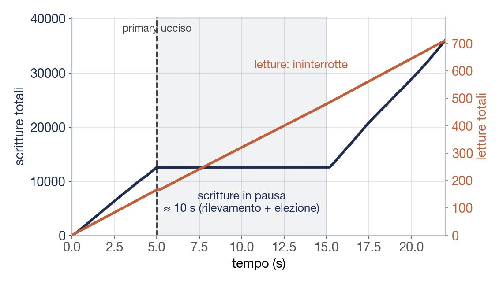
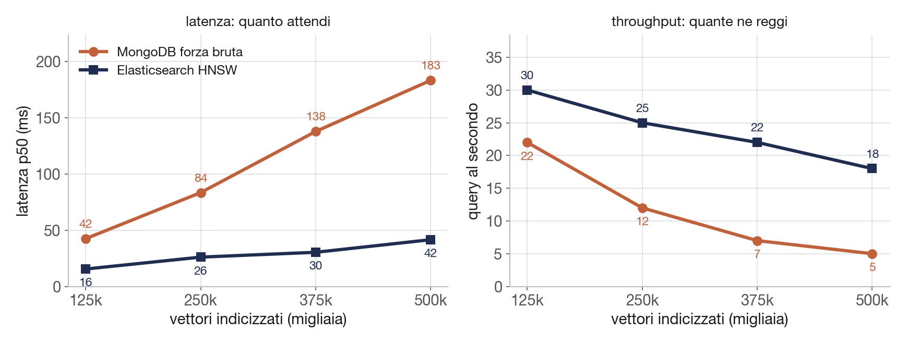
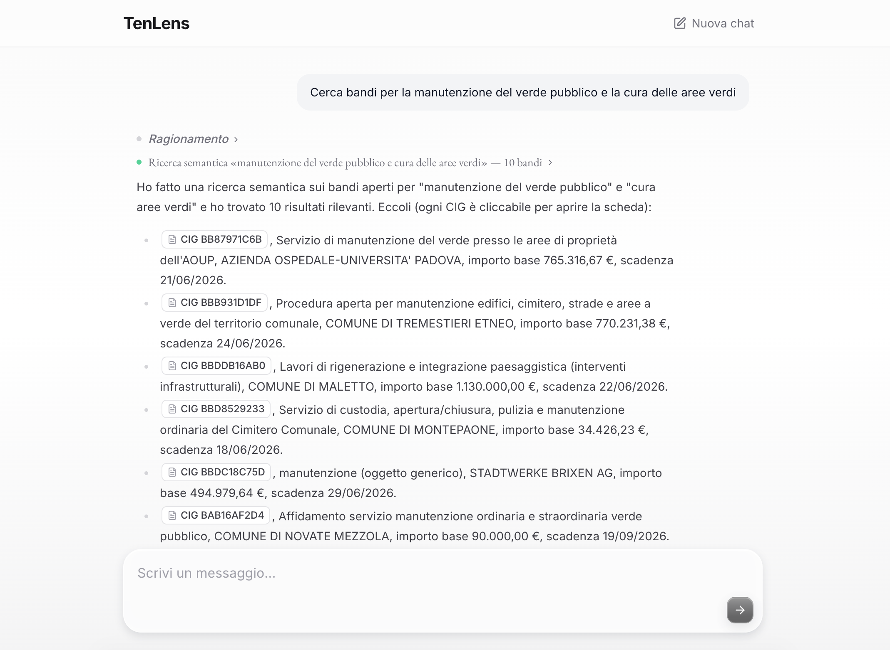
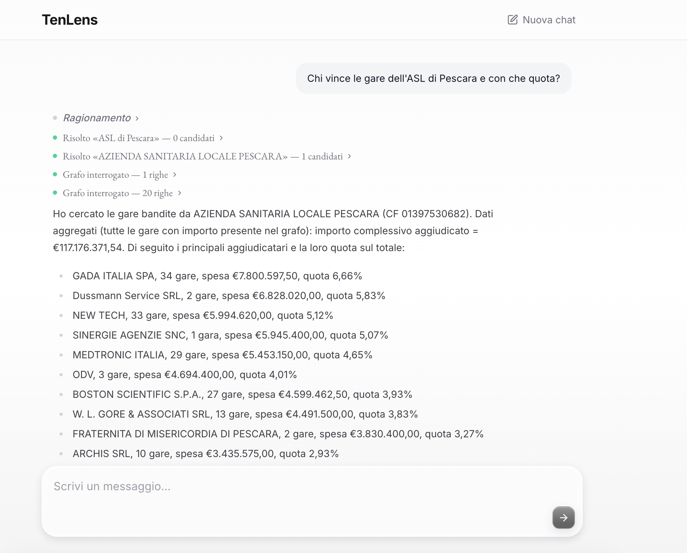
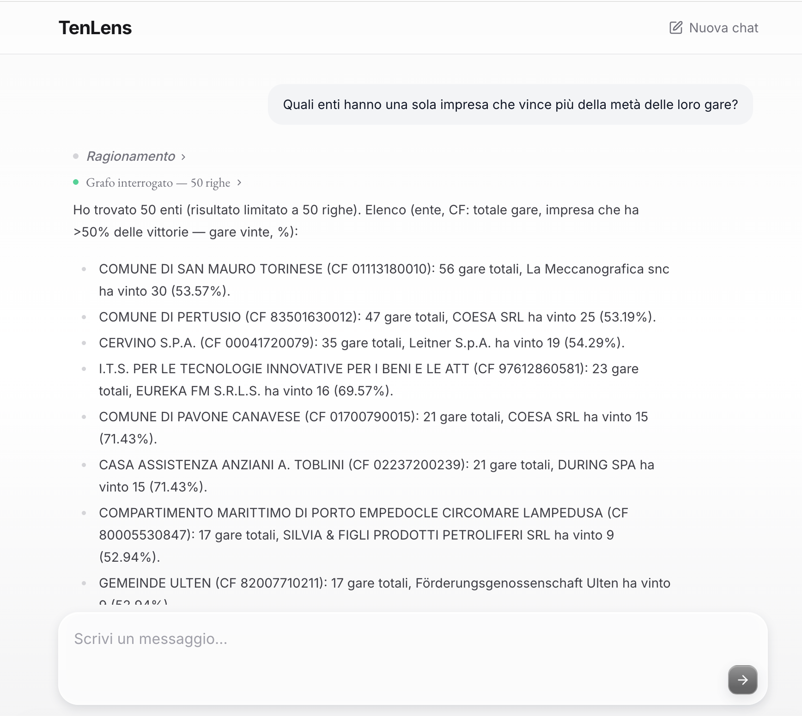

<!-- _class: title -->
<!-- _paginate: false -->
<!-- _footer: '' -->

# Ten(ders)Lens
## Un'architettura dati poliglotta per gli appalti pubblici italiani

Youssef Bimezzagh

Università degli Studi di Milano-Bicocca · Laurea Magistrale in Informatica

Architetture Dati, a.a. 2025/2026

Scalabilità · Idempotenza · Ricerca vettoriale · Un agente che interroga i dati

---

Il problema
## Molti bandi, poca conoscenza

Ogni anno in Italia vengono pubblicati centinaia di migliaia di bandi di gara, distribuiti su portali eterogenei e in un formato di difficile lettura. Monitorarli comporta un costo rilevante, in particolare per le piccole imprese.

- **Individuare i bandi pertinenti è già un'operazione onerosa.**
- **Il quadro d'insieme resta implicito** quali operatori si aggiudicano sistematicamente le gare di un dato ente, quanto è concentrato un mercato: domande che l'analisi di una singola gara non consente di affrontare.

TenLens integra due dimensioni — il contenuto dei bandi e la rete degli aggiudicatari — rendendole interrogabili congiuntamente. La sua realizzazione su <strong>2,3 milioni di avvisi reali</strong> ha evidenziato quattro problemi concreti, oggetto di questa presentazione.

---

Architettura
## Tre database, un compito ciascuno

Ciascun database assolve la funzione per cui è più adatto, sugli stessi dati di gara.

- **MongoDB: lo store di riferimento** un documento completo per ogni gara, da cui si ricostruiscono gli altri due.
- **Neo4j: le relazioni** la catena stazione appaltante → gara → aggiudicatario, per le interrogazioni di tipo relazionale.
- **Elasticsearch: il significato** ricerca dei bandi per contenuto semantico, non per corrispondenza esatta.

Grafo e indice sono <em>proiezioni</em> derivate da MongoDB. La pipeline che li alimenta (<code>ingest → canonico → entità → embedding → sync</code>) è idempotente: una riesecuzione elabora soltanto i dati nuovi.

---

Scalabilità · 1 di 3
## Due regimi di costo al crescere dei dati

Al crescere del dataset, la ricerca per <strong>CIG</strong> resta nell'ordine di 1-2 ms: l'indice opera in tempo logaritmico, indipendente dalla mole. Le aggregazioni che scandiscono <em>l'intera</em> collezione crescono invece linearmente con i dati (×4,4 dal 25% al 100%) e costituiscono, su una singola macchina, il collo di bottiglia.

Lookup su indice (in basso): costante. Aggregazione full-scan (in alto): crescente con i dati.

---

Scalabilità · 2 di 3
## Distribuire il carico: lo sharding

La soluzione consiste nel distribuire i dati su più nodi. Su un cluster dedicato (un droplet con <strong>4 vCPU e disco NVMe</strong>), portando lo sharding di MongoDB da 1 a 5 nodi, la latenza delle aggregazioni diminuisce del 41% e il throughput in scrittura aumenta del 30%, senza punti caldi. È una proprietà di MongoDB, che integra sharding e replica; Neo4j Community offre la sola alta disponibilità e non partiziona un grafo connesso su più nodi.

Barre: throughput in scrittura (crescente). Linea: latenza dell'aggregazione (decrescente). Andamento monotòno su entrambi gli assi.

---

Scalabilità · 3 di 3
## Comportamento in caso di guasto

Il nodo primario viene terminato di colpo durante la scrittura, a simulare un crash reale. Il cluster non lo rileva immediatamente: lo riconosce dopo il timeout dei battiti (~10 s) e procede a eleggere un nuovo primario. Nell'intervallo le scritture si interrompono; le letture dai secondari proseguono.

36 mila scritture, 16 fallite, nessun dato perso; le letture non si interrompono.

---

Idempotenza dell'ETL
## Riesecuzione dell'ETL senza duplicati

L'ETL non è un'operazione una tantum: i dati ANAC crescono e il caricamento va ripetuto con frequenza. Il vincolo è univoco: una riesecuzione non deve mai produrre un duplicato.

- **Due fonti, un modello** Pubblicità Legale e OCDS presentano strutture diverse; un adattatore per fonte le riconduce al medesimo record canonico, rendendo la provenienza trasparente a valle.
- **Il CIG come chiave naturale** la scrittura avviene in <em>upsert</em> sulla chiave: ricaricare una gara già presente la aggiorna anziché duplicarla. Una riesecuzione completa produce 0 duplicati su 2,4 milioni di record.
- **La medesima chiave funge da join** una gara presente in entrambe le fonti confluisce in un unico record (22 mila gare); aggiudicazioni, rettifiche e ricorsi si accumulano sotto lo stesso CIG, ricomponendo la storia della gara.

---

Idempotenza dell'ETL · le entità
## Riconciliazione delle entità (record linkage)

Problema analogo: una stessa impresa compare con denominazioni diverse e priva di un identificativo trasmesso via API. Stabilire quando due denominazioni indicano lo stesso soggetto è un problema di <em>record linkage</em>.

- **Il fattore critico è il numero di confronti** il confronto esaustivo di ciascun soggetto con tutti gli altri richiederebbe 91 miliardi di coppie.
- **Il blocking lo rende trattabile** i nomi simili vengono raggruppati in blocchi e confrontati solo internamente: i confronti scendono da 91 miliardi a 94 mila.
- **La decisione si basa sul codice fiscale, non sul nome** precisione 1,00 sul gold set. Si privilegia un collegamento mancato a uno errato: questi link alimentano segnalazioni di anomalia, in cui un falso positivo ha un costo elevato.

---

Ricerca vettoriale
## Ricerca per significato

L'obiettivo è reperire un bando per <strong>contenuto semantico</strong>, non per corrispondenza letterale ("sfalcio" recupera "manutenzione del verde"). La scelta progettuale oppone la similarità esatta a forza bruta in MongoDB (precisa ma lineare) all'indice approssimato di Elasticsearch (rapido ma non esatto).

A 500 mila lotti: ~5 query/s con MongoDB, ~18 con Elasticsearch (4-5× più rapido), al prezzo di un recall intorno all'89%.

---

Un agente che interroga i dati
## Un agente sopra i tre database

L'ultimo componente rende l'intero sistema interrogabile in linguaggio naturale: non un traduttore da testo a query, ma un <strong>agente che ragiona su più passi</strong>.

- **Function-calling, fino a dieci passi** a ogni iterazione seleziona uno strumento, ne valuta il risultato e determina l'azione successiva, fino alla risposta.
- **Dieci strumenti, distribuiti sui tre database** è qui che l'architettura poliglotta produce il proprio vantaggio: ogni domanda viene instradata al motore appropriato:
  - il **grafo** per le relazioni,
  - **Elasticsearch** per il significato,
  - **MongoDB** per la scheda della gara.

L'interrogazione avviene in italiano; la scelta di dove e come cercare è demandata all'agente.

---

Un agente che interroga i dati · cosa sa fare
## Dieci strumenti, una domanda alla volta

Gli strumenti coprono i casi d'uso reali: alcuni restituiscono dati, altri producono un grafico o una rete esplorabile.

- **Sul grafo** conteggi e classifiche, profilo di un'impresa, rete delle collaborazioni, metriche rese come grafico.
- **Sul significato** ricerca dei bandi per tema, gare raggruppate per argomento.
- **Sulla scheda e oltre** il dettaglio completo di una gara, la stima del prezzo di aggiudicazione atteso e la ricerca web per il contesto normativo.

Un ulteriore strumento risolve le denominazioni imprecise nelle entità esatte del grafo, evitando inferenze arbitrarie. Su un insieme di domande di prova, le risposte sono tutte corrette.

---

L'agente al lavoro · ricerca per significato
## "Cerca bandi per la manutenzione del verde pubblico"

Senza parole chiave: l'agente ricerca per <strong>significato</strong> (embedding + kNN), recuperando gare formulate diversamente — "cura aree verdi", "sfalcio", "rigenerazione paesaggistica" — che una ricerca testuale non intercetterebbe. Ogni <strong>CIG è cliccabile</strong> e apre la scheda completa.

Ricerca vettoriale sui bandi: pertinenza per concetto, non per stringa. Risultati reali con importo e scadenza.

---

L'agente al lavoro · un esempio reale
## "Chi vince le gare dell'ASL di Pescara, e con che quota?"

Una domanda in italiano. L'agente <strong>risolve la denominazione</strong> ("ASL di Pescara" → <em>Azienda Sanitaria Locale Pescara</em>, CF 01397530682), <strong>interroga il grafo</strong> e calcola la <strong>concentrazione di mercato</strong>: aggiudicatari, numero di gare e quota sul totale aggiudicato (117 M€).

Disambiguazione della denominazione, query sul grafo e aggregazione: tre passi per una sola domanda. È la lente sulle "red flag" di concentrazione.

---

L'agente al lavoro · il quadro d'insieme
## "Quali enti hanno una sola impresa che vince più della metà delle gare?"

È una domanda a cui <strong>l'analisi di una singola gara non risponde</strong>: richiede di incrociare ente↔gara↔aggiudicatario sull'intero dataset. L'agente la traduce in una query sul grafo e individua i <strong>mercati di fatto monopolizzati</strong>, con ente, totale gare, impresa dominante e quota.

Es. Comune di Pavone Canavese: 21 gare, COESA SRL ne vince 15 (71%). La lente sulle "red flag" di concentrazione, su scala nazionale.

---

Conclusioni
## Quattro scelte, quattro misure

Ogni problema è stato chiuso con una misura, non con un'opinione; i limiti sono dichiarati, non taciuti.

- **Scalabilità:** query su indice costanti, aggregazioni distribuite sugli shard (−41%), failover automatico senza perdita di dati.
- **Idempotenza:** zero duplicati a scala piena; il CIG come chiave naturale e di join.
- **Ricerca vettoriale:** l'esattezza di MongoDB contro la velocità di Elasticsearch, recall all'89%: compromesso dichiarato.
- **L'agente:** dieci strumenti sopra i tre store, interrogabili in italiano.

Il filo conduttore è uno: <strong>ogni affermazione è sostenuta da una misura.</strong>

